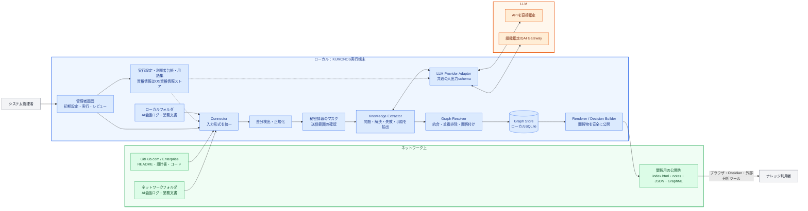

# KUMONOS

**AIとの会話を、組織の力へ。**

## 概要

KUMONOSは、**AIとの仕事から生まれた知恵を、後から探して再利用できる形に自動整理するツール**です。

### 目的

個人のフォルダやAIとの会話に埋もれている、問題の解き方、失敗から得た注意点、便利な手順などを、組織で再利用できる知識に変えることが目的です。

人が毎回メモを作らなくても、KUMONOSが会話ログを読み取り、役立つ内容を見つけて整理します。

### 背景・課題

AIとの会話には、多くの有用なノウハウが含まれています。しかし、現在は次のような問題があります。

- 会話ログが個人のフォルダに分散し、ほかの人から見つけにくい
- ログが長いため、後から必要な部分を読み直すのが難しい
- 同じ問題を、別の人や別の案件で何度も調べ直している
- 有用な解決方法が見つかっても、正式な手順や組織標準になるきっかけがない
- AIが提案しただけの内容と、実際に確認できた内容が混ざっている

### 解決策（今回の実装）

現在は設計段階です。最初の実用版では、次の処理を自動化します。

1. 管理者が指定したフォルダやGitHubリポジトリから、会話ログと文書を集める
2. 新しく追加・更新されたログだけを読み取る
3. 長い会話から、問題、解決方法、失敗、注意点、再利用できる手順を抜き出す
4. 似た内容をまとめ、関連する知識同士を結び付ける
5. どの会話から作られた知識なのか、出典を残す
6. 人が確認しやすいMarkdownと、システムで扱えるJSONを出力する
7. 複数の人や案件で繰り返し確認された知識を、標準化候補として提示する

KUMONOSが自動的に組織標準を決定することはありません。最後の確認と正式な運用への反映は、人が行います。

```text
AIとの会話ログ
      ↓
役立つ部分を見つける
      ↓
分かりやすいノウハウとして整理する
      ↓
似た知識を結び付ける
      ↓
人が確認し、必要なら正式な手順へ反映する
```

Obsidianは、生成されたノウハウを見るための選択肢の一つです。KUMONOSを動かすためにObsidianを導入する必要はありません。

### AIへの接続方法

KUMONOSは、次の二つの接続方法を同じ画面から選べるようにします。

- **APIを直接指定**：APIキー、モデル名、必要に応じてBase URLを入力する
- **組織指定のAI Gateway**：管理者向け画面で生成された設定内容を貼り付ける

どちらを選んでも、知識、出典、グラフ、判断候補の形式は変わりません。接続方法の違いはLLM接続部の内側だけで扱います。貼り付けた設定内容をプログラムとして実行せず、必要な接続項目だけを安全に読み取ります。

### システム構成図



青はKUMONOSを動かすローカル端末、緑はネットワーク上の入力・公開先、橙はLLM接続先を表します。SQLiteと資格情報は実行端末側へ置き、ネットワークドライブへは閲覧用の生成物だけを公開します。

### 使い始める流れ

1. 管理者がインストーラーを実行し、デスクトップのKUMONOSを起動する
2. 初回設定画面で、参照先、出力先、LLM接続、利用者の表示方法を登録する
3. 「確認実行」で対象件数、除外件数、送信予定量、出力権限を確認する
4. 「更新して公開」を実行し、成功後に`index.html`を開く
5. 以後は手動実行またはWindowsタスクスケジューラで差分だけを更新する

閲覧者の端末にはKUMONOSやObsidianを必須とせず、ネットワークドライブ上の`index.html`をブラウザで開くだけでも結果を確認できます。

### MVPで生成されるもの

最初の実用版では、指定フォルダを処理すると次の出力を生成します。

| 出力 | 用途 |
|---|---|
| `index.html` | 候補、矛盾、根拠不足を確認し、次の行動を判断する |
| `notes/` | 抽出されたノウハウを人が読む。Obsidianでも開ける |
| `graph.json` | 知識と関係を、ほかのシステムから利用する |
| `graph.graphml` | Gephiなどの外部グラフツールで詳しく分析する |
| `decisions.json` | 標準化、統合、検証などの判断候補を機械的に扱う |
| `reports/latest-run.json` | 処理件数、エラー、マスク件数を確認する |

`index.html`は単なるネットワーク図ではありません。知識のつながりに加えて、KUMONOSが「なぜ今確認すべきか」と「次に何をすべきか」を表示します。

## 詳しい説明

KUMONOSは、指定されたフォルダやAIエージェントの会話ログから、再利用可能なノウハウを抽出し、出典付きの知識グラフとして編成するためのオープンソース・ソフトウェアです。

個人ごとに蓄積される試行錯誤、解決方法、失敗事例、設計判断を自動的に結び付け、複数人・複数案件に共通する知見や標準化候補を見つけられる状態を目指します。

## KUMONOSが解決すること

AIエージェントとの会話には、次の仕事で再利用できる知識が大量に含まれています。しかし、生の会話ログは長く、ノイズが多く、人が毎回読み直して整理することは現実的ではありません。

KUMONOSは、この流れを自動化します。

```text
対象フォルダ・会話ログ
        ↓
差分検出・正規化・秘匿処理
        ↓
問題、解決方法、失敗、手順、設計判断を抽出
        ↓
既存知識との統合・重複排除・関係付け
        ↓
知識グラフ・Markdown・標準化候補を出力
```

## 製品の境界

KUMONOSは、特定のAIエージェント、共有ストレージ、ノートアプリに依存しない独立した知識編成エンジンとして設計します。

- 入力元は、設定された任意のローカルフォルダ、ネットワークフォルダ、ログ形式として扱う
- GitHub.comとGitHub Enterpriseのリポジトリを、任意の入力元として扱う
- Codex、Claude Code、汎用JSONL、Markdown、テキストを段階的に扱う
- 入力ファイルを変更せず、生成物はいつでも再構築できるようにする
- Obsidianは必須コンポーネントではなく、出力Rendererの一つとして扱う
- AIの発言と、コード・テスト・成果物で確認された知識を区別する
- 正式な手順・ツール・運用への反映は、人間のレビューを経て行う

## 想定する知識の成熟段階

| 状態 | 意味 |
|---|---|
| `draft` | 一つの会話から抽出された仮説 |
| `observed` | 成果物や実行結果による裏付けがある |
| `repeated` | 複数人または複数案件で同じ知見が確認された |
| `candidate-standard` | 組織標準として検討する価値がある |
| `approved` | 人間のレビューを通過した |
| `operationalized` | 正式なツール、手順、運用へ反映された |

## 現在の状態

現在は要件定義・アーキテクチャ設計段階です。最初のMVPでは、少人数分のCodex／Claude Codeログを差分処理し、「問題と解決」「失敗と注意点」「再利用可能な手順」を出典付きMarkdownとグラフデータへ変換することを目標とします。

## ドキュメント

- [要件](docs/requirements.md)
- [暫定アーキテクチャ](docs/architecture.md)
- [出力データと視覚化の設計](docs/output-and-visualization.md)
- [GitHub入力の設計](docs/github-connector.md)
- [LLM接続の設計](docs/llm-connection.md)
- [アプリMVPの起動・設定・運用設計](docs/app-mvp.md)
- [MVPロードマップ](docs/roadmap.md)
- [MVP出力サンプル](examples/mvp-output/README.md)
- [公開リポジトリ由来の出力サンプル](examples/public-repositories-demo/README.md)

## ライセンス

KUMONOSは[Mozilla Public License 2.0](LICENSE)の下で公開されています。
